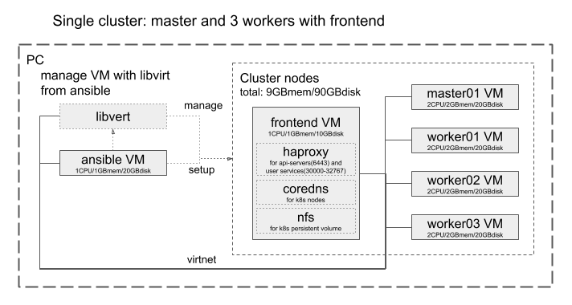
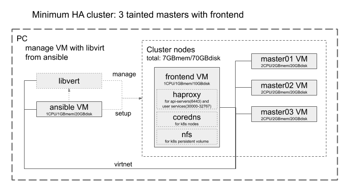
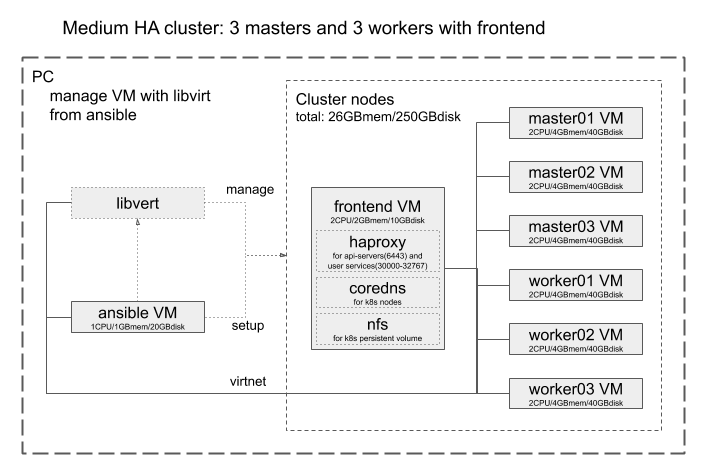
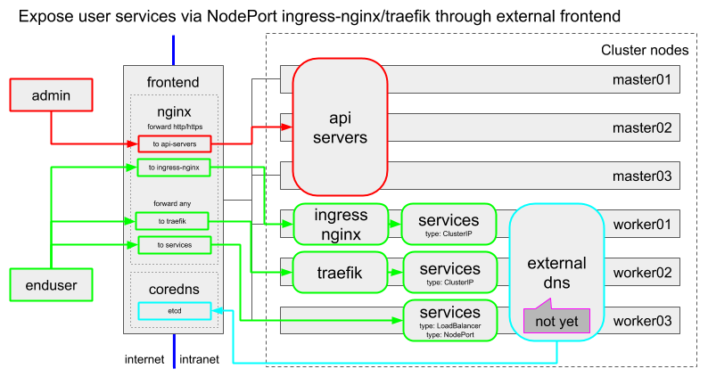

Setup kubernetes cluster
========================

This scripts setup kubernetes cluster Ubuntu VMs from cloud image using libvirt.

# How to use

Before run playbook, access your `libvirt_host` via ssh to add record for accessing from ansible container by attaching `.ssh/known_hosts`.

## Install dependencies

Run
```
./install.sh
```
or 
```
KNOWN_HOSTS=<full path to your known_hosts> STEP=kubeadm ./run-ansible.sh -i ../libvirt/dist/<created-by-libvirt-playbook>  site.yaml -k -K
```

## Bootstrap cluster

Run playbook with inventory file created by `libvirt` playbook.
Use `-k` option for input ssh passphrase and `-K` option for `sudo` if you need.
```
KNOWN_HOSTS=<full path to your known_hosts> STEP=kubeadm ./run-ansible.sh -i ../libvirt/dist/<created-by-libvirt-playbook>  bootstrap.yaml -k -K
```







## Use DNS server on `frontend` instance to access inside cluster, e.g. your services.

Add record into `/etc/hosts` and reboot your machine.

```
# k8s HA cluster frontend with nginx as load balancer
192.168.100.40 master.<cluster_type>.<stage>.<domain>
```

## Sample manifests

### To check cluster with adding nginx service

Login to any node with SSH.
```
sudo -i
export KUBECONFIG=/etc/kubernetes/admin.conf
# Copy `nginx-test.yaml` from `playbooks/kubeadm/samples/` to any node.
kubectl apply -f nginx-test.yaml
kubectl get svc/nginx
```

Then, access the nginx service from web client to following:
`http://master.<cluster_type>.<stage>.<domain>:31080`

## Ingress



**To address application that listens both udp and tcp in same port, this cluster uses external `nginx` for load balancer and `traefik` as ingress controller.**

### Use ingress-traefik controller

To control not only http and tcp, also udp ingress, `ingress-traefik` is helpful.
To deploy `ingress-traefik`, do `kubectl apply -f sample/traefik*` yaml files.

### Use ingress-nginx controller

Deploy ingress-nginx controller running `kubectl apply -f samples/ingress-nginx-controller.yaml`.
This manifest is downloaded from `https://raw.githubusercontent.com/kubernetes/ingress-nginx/master/deploy/static/provider/baremetal/deploy.yaml` and added `nodePort: 30080` and `nodePort: 30443` for its service.

Deploy ingress object from `sample/ingress-nginx.yaml`
If you set sub-path into `spec.rules.http.paths.path`, e.g. as `/test`, you need to construct same directory structure in the pod's volume.

To access nginx service using donamin name, add record into `/etc/hosts` in your local machine.
```
192.168.100.40 ingress-nginx.<cluster_type>.<stage>.<domain>
```
Also, add DNS record as follow at frontend host:
```
etcdctl set /coredns/<domain>/<stage>/<cluster_type>/ingress-nginx '"host": "192.168.100.40"'
```
And ingress-nginx config file into `http` directive in `/opt/nginx-lb/nginx.conf` as follow, or copy `samples/nginx.conf` to `/opt/nginx-lb/nginx.conf`:
```
  include /etc/nginx/conf.d/ingress-nginx.conf;
```
Also, copy `samples/nginx-ingress-nginx.conf` into `/opt/nginx-lb/nginx-ingress-nginx.conf`
And recreate `nginx` container using `sample/nginx-recreate.sh`.
Then, access `http://ingress-nginx.<cluster_type>.<stage>.<domain>` from browser.

## Others

### Deploy Kubernetes Dashboard

Same as above, copy files in `playbooks/kubeadm/samples/` and run following:
* `./deploy-kubernetes-dashboard.sh`

### Deploy Metrics Server
Same as above, copy files in `playbooks/kubeadm/samples/`.
See `deploy-metrics-server.sh`, download manifest for metrics-server and edit the it.

Then, run following:
* `./deploy-metrics-server.sh`
